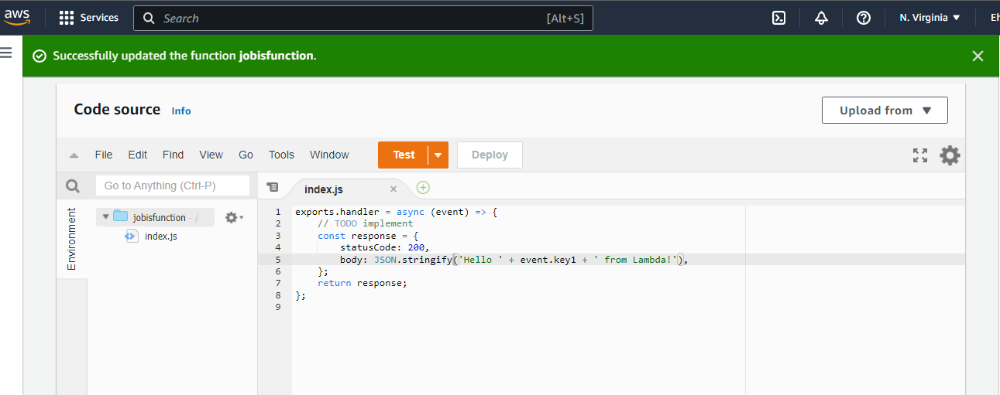

#  AWS-LAMBDA

Creating an S3 bucket, from the console that is triggered by a Lambda function. Lambda is triggered everytime there is an input or output to the S3 bucket.

# Requirement:

- An AWS account.
- Basic understanding of a Lamdba function.
- Basic understanding of AWS S3 bucket.

# Architecture:


# Step 1.

- Log into you AWS account and search for S3
- Click on `Create bucket`
Under ***General Configuration*** do the following
- Enter bucket name (name must be globally unique without any space or upper letter case)
- Region, choose a region. Please note your region because your Lambda must be created in that same region

Under ***Object Ownership***
- Click on `ACLs disabled`

Under ***Block Public Access settings for this bucket***
- Uncheck block public access 


- Click acknowledgement


Leave everyother option as default

Click on `Create bucket`

- Upload file into bucket click on `upload`

- Click on ***Permissions*** and drop bucket policy and `save`

- Click on ***Properties*** and `enable static website hosting`

- Once these are done, it means the bucket has now been made public 

# Step 2. Create a Lambda Function

- In the AWS search bar type in Lambda


- Click on `Create a function`

- Click on `Author from Scratch

# Under Basic information

```
Function name = Your choice
Runtime       = Node.js 12.x
Permission    = Default
```


- Click on `Create function`

The following message should pop up on your screen. 


# Add Trigger

- Click  `Add trigger`

# Under Trigger Configuratios

- Select S3

- Bucket: pick your S3 bucket name

- Event Type : "All objects create events"
This means that the trigger will go off once there is an input or output from the S3 bucket

- Acknowledge  Recursive invocation 

- Click `Add`


- Click on `Test`

#  Under ***Test event***

```
Event name : name of your choice
Template:     Hello-world
JSON statement format: 
 {
  "key1": "place your name here",
  
  
}
```
- Click on `Save`


# Modify a Lambda Function

- Click on `Code` on the Fuction.

- Replace the  default body of the  code with the following string in bracket

```
body: JSON.stringify('Hello ' + event.key1 + ' from Lambda!'),

```


- Click on `Deploy`



- Click on `Configuration`

- Click on `Permissons`


- Edit `Executive role`

```
Description: your choice
Time out: your choice (i am picking 10 mins)
Execution role : Use an existing role
```
- Click on `Save`

- Click on `Test`


# Add files to the S3 bucket.

- Go to S3 and upload a file or folder

- Go back to LAMBDA to check if it was triggered.

- Click on your `Function` to view details

- Click on `Monitor`


At the top right corner of innvocatiosn click the three dots

- Click `View in metrics`

- Cloud watch will load the innvocations


✨✨✨✨✨✨✨✨


